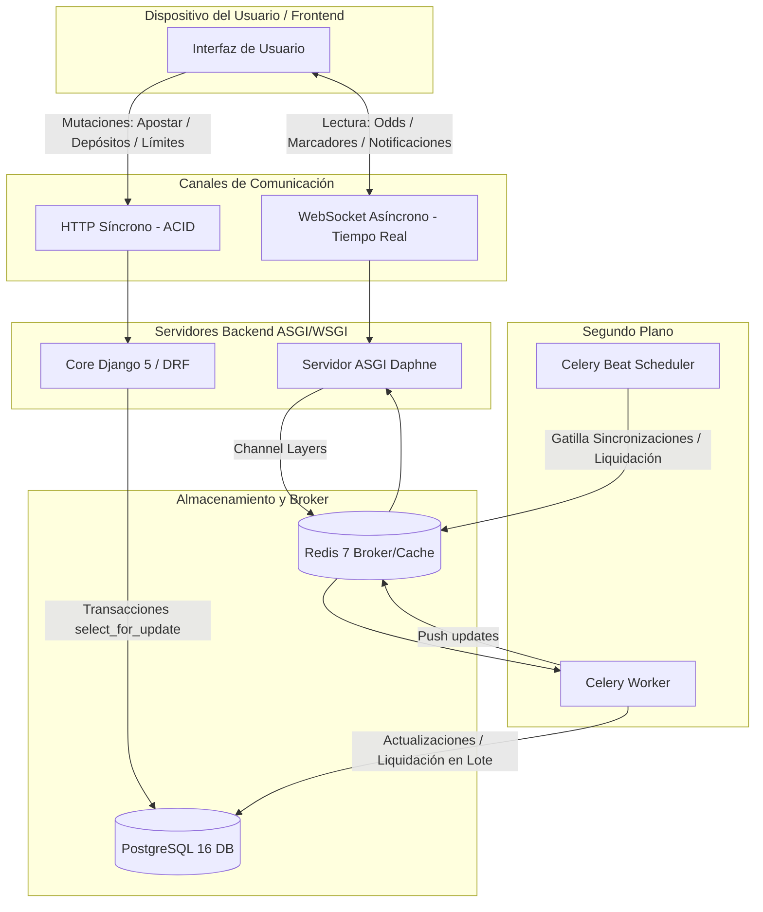
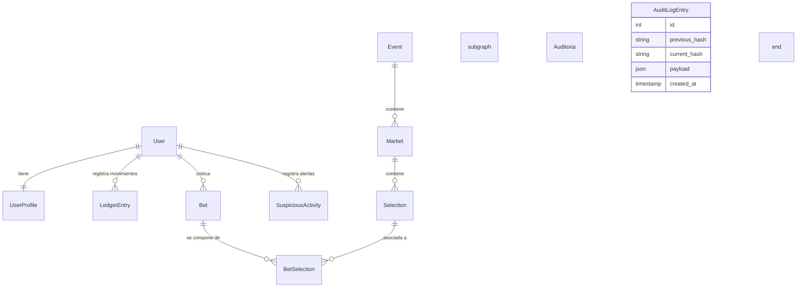
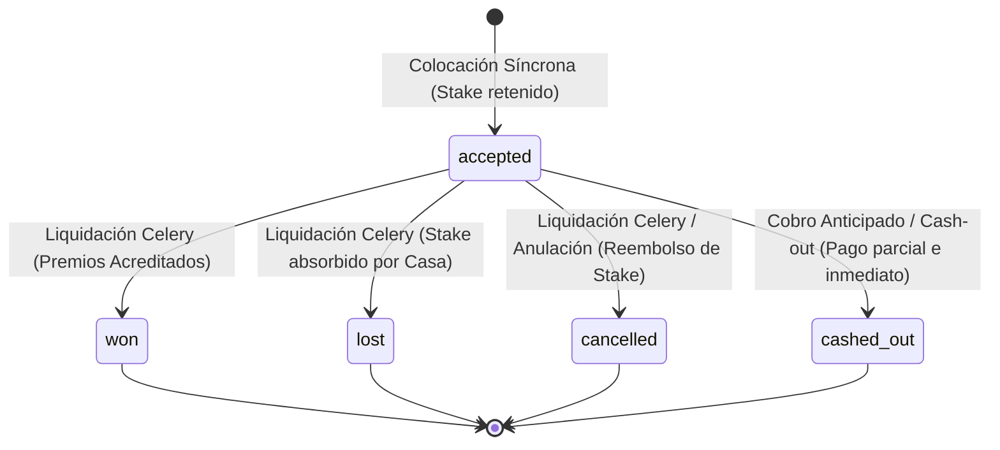

# FairBet Lab - Simulador Educativo de Apuestas Deportivas

**FairBet Lab** es una plataforma web educativa de apuestas deportivas que utiliza **moneda virtual** (fichas virtuales sin valor monetario real) con un fuerte énfasis en la integridad contable, el juego responsable y el cumplimiento normativo según los estándares de la **Ley 31557** de Perú y su reglamento **DS 005-2023-MINCETUR**.

> **[¡IMPORTANTE!] AVISO LEGAL OBLIGATORIO**
> *Plataforma educativa con moneda virtual. No constituye una casa de apuestas.*

---

## 🛠️ Stack Tecnológico

* **Core**: Django 5 + Django REST Framework (DRF)
* **Base de Datos**: PostgreSQL 16 (persistencia de datos)
* **Motor Asíncrono**: Daphne (ASGI) + Django Channels (comunicaciones en tiempo real)
* **Caché y Mensajería**: Redis 7 (broker de Celery y Channel Layer)
* **Tareas en Segundo Plano**: Celery + Celery Beat
* **Entorno**: Docker & docker-compose

---

## 📐 Diagramas de Arquitectura y Negocio (Mermaid)

### A. Diagrama de Arquitectura Híbrida
Representa la separación estricta de responsabilidades entre HTTP síncrono y WebSockets en tiempo real:



### B. Diagrama de Entidad-Relación (ER)
Esquema de relaciones relacionales de base de datos garantizando partida doble e inmutabilidad:



### C. Máquina de Estados de un Ticket de Apuestas (`Bet`)
El ciclo de vida transaccional e inalterable de un boleto:



---

## 🚀 Guía de Instalación y Ejecución

La plataforma viene completamente dockerizada para desarrollo y testing aislado.

### Requisitos Previos
* Docker y Docker Compose instalados.
* Puerto `8000` y `6379` libres localmente.

### Instrucciones Paso a Paso

1. **Clonar e inicializar variables de entorno**:
   ```bash
   cp .env.example .env
   ```

2. **Levantar contenedores con Docker Compose**:
   ```bash
   docker-compose up -d --build
   ```

3. **Ejecutar migraciones de base de datos**:
   ```bash
   docker-compose exec web python manage.py migrate
   ```

4. **Crear usuario administrador predeterminado**:
   ```bash
   docker-compose exec web python manage.py createsuperuser
   ```

5. **Poblar catálogo deportivo inicial (Seeders)**:
   ```bash
   docker-compose exec web python manage.py sync_fixtures
   ```

6. **Correr la suite completa de pruebas unitarias**:
   ```bash
   docker-compose exec web pytest
   ```

---

## 📡 Endpoints de la API v1

### Autenticación y Perfil (Fase 1)
* `POST /api/v1/auth/register/` - Registro KYC (DNI, mayoría de edad).
* `POST /api/v1/auth/login/` - Inicio de sesión.
* `GET /api/v1/users/me/` - Obtener información del perfil propio.

### Billetera Virtual (Fase 2)
* `POST /api/v1/wallet/deposit/` - Depósito simulado en partida doble.
* `POST /api/v1/wallet/withdraw/` - Retiro simulado en partida doble.
* `GET /api/v1/wallet/balance/` - Balance en vivo derivado sumando el historial contable.

### Apuestas y Cuotas (Fase 4, 5, 11)
* `GET /api/v1/betting/events/` - Listar eventos (scheduled, live, finished).
* `POST /api/v1/betting/bets/` - Colocación síncrona de apuestas (Simples/Combinadas). *Requiere cabecera `Idempotency-Key`*.
* `POST /api/v1/betting/bets/{id}/cashout/` - Cobro anticipado de apuestas aceptadas.

### Juego Responsable (Fase 7)
* `GET /api/v1/responsible/limits/` - Consultar límites diarios/semanales/mensuales de depósito.
* `PUT /api/v1/responsible/limits/` - Modificar límites (cooldown preventivo de 24h ante aumentos).
* `POST /api/v1/responsible/self-exclude/` - Autoexclusión atómica y bloqueante (temporal o permanente).

### Panel Operador y Reportes (Fase 10)
* `GET /api/v1/dashboard/metrics/` - Métricas operativas en vivo (GGR, exposición de eventos, usuarios activos). *Solo Administradores*.
* `GET /api/v1/dashboard/mincetur-report/` - Exportación de reporte mensual de cumplimiento en formato CSV. *Solo Administradores*.

---

## 🔒 Seguridad e Integridad Contable
* **Idempotencia**: Endpoints de transacciones financieras y apuestas obligatoriamente exigen un UUID `Idempotency-Key` en cabeceras HTTP, cacheado en Redis por 5 minutos, previniendo reprocesamientos accidentales del navegador.
* **Append-Only Auditoría**: Se registran hashes SHA-256 encadenados secuencialmente para cambios críticos de apuestas y Ledger contable. El endpoint administrativo `/api/v1/audit/verify/` valida la integridad de la base de datos detectando intrusiones a nivel de SQL.
