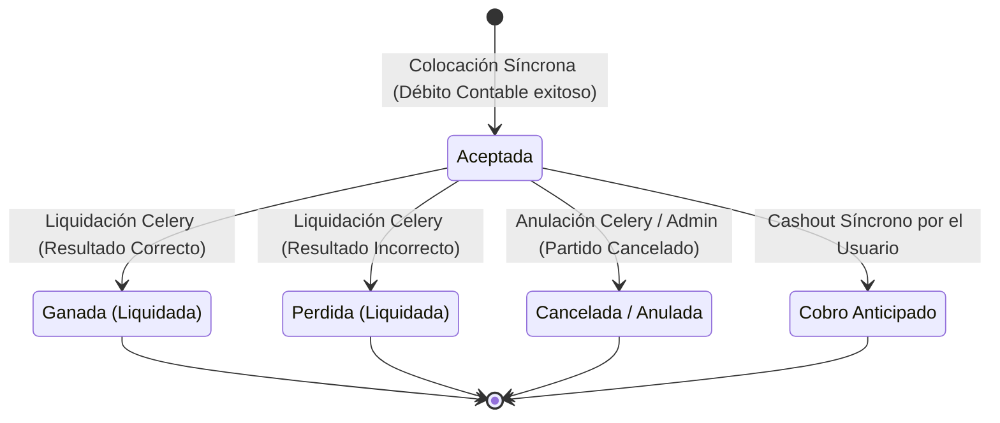

# ADR 0007: Diseño de la Máquina de Estados de la Apuesta (Bet)

## Estado
Aprobado

## Fecha
27 de mayo de 2026

## Autor
Antigravity (Asistente de Desarrollo)

---

## Contexto

El ciclo de vida de una apuesta en una plataforma deportiva regula no sólo el flujo operacional, sino también la liberación y abono de saldo de forma financiera en partida doble. Una transición de estado incorrecta o inválida (por ejemplo, permitir cobrar un *cash-out* en una apuesta que ya está resuelta como perdida) generaría inconsistencias insalvables y pérdidas económicas críticas en el Ledger de contabilidad.

Por lo tanto, es mandatorio diseñar y forzar una máquina de estados determinista y estricta para el modelo `Bet` con sus debidos disparadores de transición.

---

## Máquina de Estados Diseñada

El ciclo de vida se modela de manera determinista utilizando la siguiente gramática de transiciones:

### Reglas de Transición y Negocio:
1. **Estado Inicial**: Toda apuesta nace obligatoriamente en estado **`accepted`** (Aceptada) tras pasar los filtros de validación y ejecutarse con éxito el débito del saldo del wallet del usuario.
2. **Estados Terminales**: Los estados **`won`**, **`lost`**, **`cancelled`** y **`cashed_out`** son terminales e inmutables. NINGÚN registro contable o proceso de background puede mover una apuesta fuera de un estado terminal.
3. **Flujos Contables por Transición**:
   - `accepted -> won`: Se debita `apuestas_pendientes` (liberando la retención) y se acredita `wallet_usuario` con el payout total (`stake * odds`). La diferencia de ganancia neta es debitada de la cuenta de la `casa`.
   - `accepted -> lost`: Se debita `apuestas_pendientes` (liberando la retención) y se acredita `casa` con el monto de la apuesta (`stake`), cerrando el ciclo.
   - `accepted -> cancelled`: Se debita `apuestas_pendientes` y se acredita `wallet_usuario` con el monto exacto de la apuesta (`stake`), retornando los fondos intactos por anulación del partido.
   - `accepted -> cashed_out`: Se calcula el valor de cashout, se acredita `wallet_usuario` con dicho valor, se acredita `casa` con la diferencia a favor de la casa, y se debita `apuestas_pendientes` para liberar la retención global.

---

## Opciones Consideradas

### Opción 1: Transiciones directas sobre la base de datos sin lógica intermedia
Las transiciones se realizan mediante modificaciones de campos directas de ORM (`Bet.objects.filter(...).update(status='...')`) en cualquier parte del código.
* **Pros**: Simple de escribir inicialmente.
* **Contras**: Cero protección contra transiciones inválidas. Un bug de concurrencia o de código de Celery podría forzar estados ilegales (ej. `won -> cashed_out`), resultando en doble pago de fondos.

### Opción 2: Forzado de transiciones en métodos de guardado del modelo (Elegida)
Centralizar y encapsular toda la lógica de transición y validación del ciclo de vida dentro de métodos específicos del modelo `Bet` (ej: `settle_as_won()`, `settle_as_lost()`, `cancel_bet()`, `perform_cash_out()`), validando síncronamente el estado actual antes de modificar la base de datos y levantando excepciones bloqueantes si la transición es ilegal.
* **Pros**:
  - Encapsulación limpia de la lógica de negocio contable e integridad referencial.
  - Robusto contra bugs de Celery u operadores de administración.
  - Trazabilidad y facilidad de pruebas unitarias.
* **Contras**: Requiere mayor planificación inicial del código.

---

## Decisión

Se elige la **Opción 2 (Forzado de transiciones centralizado en métodos del modelo Bet)**. Esto garantiza el control ineludible y el aislamiento completo de las reglas transaccionales de apuestas.

---

## Consecuencias

* Se implementarán los métodos específicos de liquidación del modelo `Bet` en las fases 5 y siguientes.
* El estado actual de la apuesta se verificará en todos los endpoints de cara al usuario para inhabilitar operaciones inválidas.
