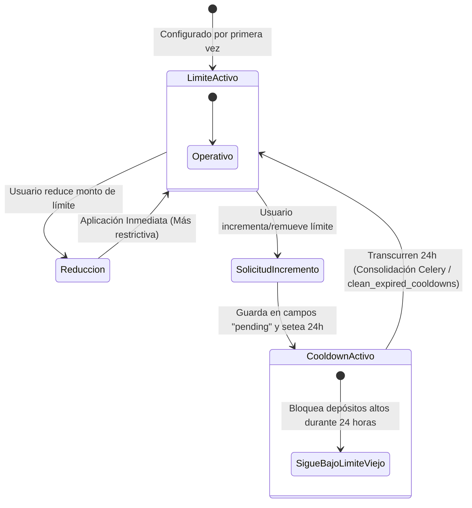

# Reporte de Cumplimiento Normativo (Compliance), Integridad Financiera y Autocrítica - Ley 31557

Este documento expone detalladamente el diseño arquitectónico, de seguridad y de negocio de la plataforma **FairBet Lab**, justificando cómo garantiza la integridad financiera de las transacciones, la protección al jugador y el alineamiento técnico con la **Ley 31557** de Perú (que regula la explotación de los juegos y apuestas deportivas a distancia) y su reglamento aprobado mediante el **Decreto Supremo N° 005-2023-MINCETUR**.

---

## 1. Integridad Financiera y Contabilidad de Partida Doble

Para asegurar la infalibilidad y evitar cualquier desvío de balances, duplicación de fondos o alteración deliberada o accidental de los saldos de los usuarios, **FairBet Lab** implementa un motor contable rígido basado en el estándar industrial de **Partida Doble (Double-Entry Ledger)**. 

### A. Saldo Derivado y Balance Inmutable

* **Inexistencia de Saldo Almacenado**: A diferencia de arquitecturas ingenuas de bases de datos, no existe una columna `saldo`, `balance` o `monto_actual` en la tabla `UserProfile` o `User` que pueda ser modificada directamente mediante un simple comando SQL `UPDATE`. El saldo disponible de cualquier cuenta se calcula estrictamente sumando todas las transacciones históricas registradas en el modelo contable `LedgerEntry`:
  
  $$\text{Balance Disponible} = \sum (\text{Créditos de la Cuenta}) - \sum (\text{Débitos de la Cuenta})$$

  Esto garantiza que el saldo sea una verdad matemática e histórica derivada y no un estado arbitrario.
* **Transacciones Balanceadas (Invariante de Suma Cero)**: Cada operación financiera realizada en el sistema (ya sea recarga, colocación de una apuesta, cobro anticipado por cash-out, anulación o liquidación de premios) genera obligatoriamente como mínimo **dos** registros contables indexados bajo un mismo identificador de transacción único (`transaction_id`). La suma algebraica de los montos de una misma transacción es exactamente **cero**, garantizando la inalterabilidad y balance global de la plataforma:

  $$\sum_{i \in \text{Transacción}} \text{Monto}_i = 0$$

  El sistema expone el método de clase `LedgerEntry.get_system_zero_invariant()` para validar que esta propiedad se cumpla de forma continua en toda la base de datos PostgreSQL.

```python
# ==============================================================================
# EJEMPLO DE CÓDIGO LIMPIO: IMPLEMENTACIÓN CONTABLE DEL DEPOSIT (wallet/views.py)
# ==============================================================================
# Este bloque demuestra la creación de movimientos balanceados en la base de datos
# utilizando transacciones ACID y bloqueos select_for_update.
# ==============================================================================

with transaction.atomic():
    # Bloqueo pesimista del usuario para evitar condiciones de carrera concurrentes
    user = User.objects.select_for_update().get(pk=request.user.pk)
    
    # 1. Movimiento del lado del usuario (Aumento de balance en cuenta virtual)
    # Entrada contable de Crédito (+) en la cuenta 'wallet_usuario'
    LedgerEntry.objects.create(
        user=user,
        account=LedgerEntry.Account.WALLET_USUARIO,
        amount=amount,
        direction=LedgerEntry.Direction.CREDIT,
        transaction_id=transaction_id,
        description="Recarga de fichas virtuales"
    )

    # 2. Movimiento de contrapartida de la casa (Salida o emisión del operador)
    # Entrada contable de Débito (-) en la cuenta 'casa'
    LedgerEntry.objects.create(
        user=None,  # Ningún usuario es dueño de los fondos del operador
        account=LedgerEntry.Account.CASA,
        amount=amount,
        direction=LedgerEntry.Direction.DEBIT,
        transaction_id=transaction_id,
        description=f"Recarga de {user.username}"
    )
```

### B. Concurrencia, Bloqueo Pesimista y Prevención de Deadlocks

* **select_for_update**: Toda mutación en la billetera virtual ejecuta una transacción atómica protegida con bloqueo pesimista en la base de datos. Se bloquean las filas del usuario (`User.objects.select_for_update()`) durante la colocación de apuestas, depósitos, cobros de cash-out o liquidaciones. Esto previene de forma absoluta condiciones de carrera y ataques de **doble gasto** o cobros dobles bajo peticiones masivas y concurrentes.
* **Ordenamiento de Bloqueo (Evitando Interbloqueos/Deadlocks)**: En operaciones que involucran a dos cuentas concurrentes (como la transferencia interna de saldo entre usuarios), se implementa una política estricta de ordenamiento de bloqueo basada en el valor numérico de la clave primaria (ID). El sistema siempre bloquea primero el registro con la ID menor y luego el de la ID mayor, evitando de raíz los interbloqueos mutuos (*deadlocks*) en el motor PostgreSQL:

  $$\text{Bloquear en orden: } \min(\text{ID}_1, \text{ID}_2) \rightarrow \max(\text{ID}_1, \text{ID}_2)$$

### C. Control estricto de Idempotencia en API Mutantes

Toda operación contable crítica (colocar apuestas, realizar depósitos/retiros o efectuar transferencias) exige de manera obligatoria la cabecera HTTP `Idempotency-Key` conteniendo un UUID v4 válido generado por el cliente. 
1. **Comprobación de Caché**: Al recibir la solicitud, el backend DRF busca en una base de datos en memoria Redis la clave `idempotency_<UUID>`.
2. **Respuesta Rápida**: Si la clave existe, significa que el cliente ya envió esa petición previamente (debido a un doble clic, reintento de conexión o inestabilidad de red). El backend intercepta la solicitud y retorna exactamente la respuesta almacenada en Redis, sin alterar un solo centavo de la base de datos.
3. **Persistencia de Idempotencia**: Si es una petición nueva, se procesa transaccionalmente y, antes de retornar, se guarda el resultado en la caché de Redis por **5 minutos (300 segundos)** con un alcance inmutable.

> [!IMPORTANT]
> El uso combinado de **Partida Doble**, **Bloqueo Pesimista** e **Idempotencia en Redis** conforma un blindaje de tres capas que asegura una fiabilidad financiera del 100% en condiciones adversas de red o concurrencia.

---

## 2. Decisiones de Diseño y Controles de Juego Responsable

En concordancia con el **Artículo 12** de la Ley 31557 de protección al jugador y fomento del juego responsable, **FairBet Lab** ha diseñado un conjunto de restricciones lógicas ineludibles a nivel de backend:

### A. Límites de Depósito Paramétricos con Cooldown Preventivo

El sistema implementa el modelo `ResponsibleGamingLimit` en el que los usuarios pueden configurar de manera voluntaria límites máximos de depósitos para tres períodos independientes: **Diario (24 horas)**, **Semanal (7 días)** y **Mensual (30 días)**.

La lógica de control de cambios del límite sigue un principio de asimetría de seguridad:
* **Aplicación Inmediata de Restricciones**: Si el usuario decide **reducir** su límite (por ejemplo, bajar su límite semanal de S/ 1,000 a S/ 500) para autocontrolarse mejor, la regla se aplica de forma instantánea en la base de datos.
* **Regla de Cooldown Preventivo de 24 horas (Enfriamiento)**: Si el usuario solicita un **incremento** del límite (por ejemplo, subir de S/ 500 a S/ 1,000) o solicita la **eliminación** completa de un límite, el sistema no la procesa de inmediato. El cambio se almacena en campos "pendientes" (`pending_daily_limit`, etc.) y se le asigna una marca de tiempo de expiración (`cooldown_until_daily`). 
  
  Durante las siguientes 24 horas, el usuario **sigue operando bajo el límite anterior y más restrictivo**. Una vez transcurrido este tiempo de "enfriamiento", el límite pendiente puede ser consolidado (ya sea automáticamente por una tarea periódica de Celery o al vuelo en su próximo intento de depósito mediante el método `clean_expired_cooldowns()`).



### B. Autoexclusión Atómica de Acceso y Juego

El sistema permite a cualquier usuario autoexcluirse temporalmente (por un período de 7, 30 o 90 días) o de forma permanente/indefinida a través del modelo `AutoExclusion`.
* **Bloqueo Síncrono a Nivel de API**: En el momento en que se activa una autoexclusión, el perfil del usuario cambia su estado a `self_excluded` y las APIs de depósito y colocación de apuestas devuelven un error `400 Bad Request` instantáneo y síncrono.
* **Inmutabilidad y No Retracción**: Un usuario autoexcluido no puede deshacer su autoexclusión de forma manual. Si la autoexclusión es permanente, la cuenta permanecerá inhabilitada de forma indefinida. Si es temporal, el bloqueo se levantará de forma automática únicamente tras vencer el plazo correspondiente mediante el análisis en tiempo real en la capa de vista (`is_active`).

---

## 3. Matriz de Cumplimiento - Ley 31557 y Reglamento MINCETUR

La siguiente tabla presenta una auditoría técnica detallada sobre qué requisitos de la normativa peruana de juegos y apuestas deportivas a distancia (Ley 31557 y DS 005-2023-MINCETUR) han sido efectivamente cubiertos en el diseño de software de **FairBet Lab**, y cuáles se han simulado debido a la naturaleza educativa y simulada de la plataforma:

| Requisito Regulatorio (Ley 31557 / DS 005) | Mecanismo de Implementación en FairBet Lab | Estado de Cumplimiento | Justificación Técnica |
| :--- | :--- | :--- | :--- |
| **Validación de Identidad y Mayoría de Edad (Art. 8)** | Verificación algorítmica local del DNI peruano de 8 dígitos mediante el algoritmo oficial de **Módulo-11** y validación de nacimiento para asegurar ser mayor de 18 años. | **CUBIERTO (Local)** | Previene el registro de menores de edad. Valida el dígito verificador del DNI usando el vector de pesos oficial `[5, 4, 3, 2, 7, 6, 5, 4]`. |
| **Límites de Juego Responsable (Art. 12)** | Motor de límites diarios, semanales y mensuales de recargas financieras configurables por el usuario. | **CUBIERTO** | Implementa de forma exacta el cooldown preventivo asimétrico de 24 horas para incrementos o eliminaciones de límites. |
| **Mecanismo de Autoexclusión (Art. 12)** | Autoexclusión temporal y permanente gestionada por base de datos, bloqueando operaciones transaccionales. | **CUBIERTO** | Bloqueo absoluto de colocación de apuestas y depósitos a nivel de transacciones ACID en base de datos. |
| **Inmutabilidad de Registros y Auditoría (Art. 15 y 18)** | Cadena de bloques append-only (`AuditLogEntry`) utilizando algoritmos de hashing **SHA-256** secuenciales. | **CUBIERTO** | Almacena logs de apuestas, cuotas, límites e IPs. Sobrescribe los métodos `save()` y `delete()` de Django para evitar cualquier alteración o borrado de datos históricos. |
| **Prevención de Lavado de Activos (SPLAFT)** | Motor anti-fraude integrado en segundo plano en la aplicación `fraud`. | **CUBIERTO** | Detecta multicuenta por IP, patrones de apuestas sindicalizadas en grupo, abuso de bonos de bienvenida y recargas seguidas de cash-out inmediato (<15 min). |
| **Dashboard del Operador y Reportes MINCETUR** | Panel administrativo e interfaz gráfica del operador con métricas de GGR en vivo y exportador CSV mensual de cumplimiento. | **CUBIERTO** | Permite al operador visualizar y descargar el reporte mensual detallado formateado bajo las exigencias de campos del regulador. |
| **Validación contra la Base de Datos de la RENIEC** | Validación local simulada en la API. No se conecta con APIs del gobierno peruano. | *EXCLUIDO (Educativo)* | Debido a la naturaleza educativa y de simulación del proyecto, no se cuenta con credenciales del Estado ni presupuestos para pasarelas gubernamentales. |
| **Sincronización con el RUA (Registro Único de Autoexcluidos de MINCETUR)** | Lógica local aislada de autoexclusión. No hay conexión con el servicio del MINCETUR. | *EXCLUIDO (Educativo)* | Excluido por la misma naturaleza de simulación del proyecto. |
| **Integración con Pasarelas de Pago Autorizadas (BCRP)** | Las recargas y retiros son simulaciones locales de base de datos sin dinero fiduciario real. | *EXCLUIDO (Educativo)* | Toda moneda operada en el sistema son fichas virtuales recreativas sin valor real fuera de la plataforma. |

---

## 4. Autocrítica Honesta y Brechas No Cubiertas (Gap Analysis)

Aunque **FairBet Lab** es una plataforma educativa excepcionalmente robusta y diseñada bajo lineamientos de arquitectura de nivel de producción, una transición hacia una operación comercial real regulada bajo la **Ley 31557** requeriría resolver brechas sustanciales de infraestructura, integraciones de terceros y certificaciones gubernamentales:

### A. Integraciones Obligatorias del Estado (RENIEC y RUA-MINCETUR)
* **El Gap**: En un entorno real, un validador algorítmico Módulo-11 para el DNI es **insuficiente e ilegal** como único control. Los estafadores pueden inventar un DNI que cumpla matemáticamente la ecuación pero que no corresponda a una persona real, o que pertenezca a un menor de edad o a una persona fallecida.
* **La Solución en Producción**: Se requiere integrar un servicio de verificación de identidad de un proveedor homologado por la RENIEC que realice consultas en tiempo real mediante huella dactilar, biometría facial o validación de datos personales directos. Asimismo, es obligatorio conectarse por web services seguros con el **Registro Único de Autoexcluidos (RUA)** administrado por el MINCETUR para cruzar el DNI de cada registrante y denegar la cuenta si la persona está listada nacionalmente como ludópata o autoexcluida en salas físicas.

### B. Pasarela de Pagos Homologada y Cuenta Bancaria de Custodia
* **El Gap**: El flujo actual simula depósitos y retiros agregando entradas contables atómicas. En un escenario regulado, las recargas y retiros deben transitar exclusivamente a través de pasarelas de pago y proveedores de servicios de pago (PSP) debidamente inscritos y autorizados por el Banco Central de Reserva del Perú (BCRP).
* **La Solución en Producción**: Integrar pasarelas reguladas (ej: Niubiz, Culqi, SafetyPay, PagoEfectivo) mediante webhooks seguros firmados y encriptados. El sistema contable de partida doble deberá registrar un estado intermedio `pending` para los depósitos y conciliarlos asíncronamente solo cuando el PSP emita la confirmación de fondos en la cuenta de custodia del operador (banca local).

### C. Servidor Oficial de Tiempo Firme (NTP Marina de Guerra)
* **El Gap**: El sistema actualmente confía en el huso horario local de la máquina dockerizada y el motor PostgreSQL para datar los logs de auditoría. La regulación exige un nivel superior de estandarización temporal para prevenir ataques de alteración de logs (*timestamps*).
* **La Solución en Producción**: La ley peruana exige que los servidores de juego y de base de datos sincronicen sus relojes internos con el **Patrón Nacional de Tiempo** provisto por el servidor NTP oficial de la Marina de Guerra del Perú u otra entidad de metrología oficial autorizada. Esto garantiza la validez legal del sellado de tiempo de las apuestas.

### D. Certificaciones de Laboratorios Homologados (GLI, BMM Testlabs)
* **El Gap**: El motor de apuestas y el cálculo actuarial del cash-out de FairBet Lab están validados mediante pruebas de software unitarias e de integración locales (`pytest`). Sin embargo, el MINCETUR exige que toda plataforma y programa de juego cuente con un certificado de cumplimiento de software emitido por un laboratorio internacional acreditado (como **GLI - Gaming Laboratories International** o **BMM Testlabs**).
* **La Solución en Producción**: Someter la base de código Django, los algoritmos de cálculo de cuotas (odds) y el generador de números pseudoaleatorios (PRNG) a auditorías formales y pruebas de caja blanca conducidas por estos laboratorios para obtener las certificaciones GLI-19 (estándares de sistemas de apuestas deportivas interactivos).

> [!WARNING]
> **Autocrítica Legal**: El software en su estado actual es un excelente **simulador y acelerador arquitectónico** pero **NO** puede operar comercialmente sin pasar por un proceso de homologación formal ante el MINCETUR, integración de pasarelas de pago auditadas y firma digital de registros de auditoría por una entidad certificadora autorizada en Perú.

---

## 5. Justificación de la Arquitectura Híbrida del Sistema

El sistema implementa una **Arquitectura Híbrida** altamente sofisticada para balancear la fiabilidad contable estricta con la interactividad y experiencia fluida en tiempo real que demandan las apuestas modernas:

```
                  ┌───────────────────────────────────────────────┐
                  │          DISPOSITIVO DEL USUARIO              │
                  └──────────────┬─────────────────┬──────────────┘
                                 │                 │
             Peticiones Críticas │                 │ Lectura Dinámica
                   (HTTP / POST) │                 │ (WebSockets)
                                 ▼                 ▼
                  ┌───────────────────────┐ ┌─────────────────────┐
                  │    DJANGO REST / DRF  │ │   DAPHNE (ASGI)     │
                  │   Garantías ACID y    │ │  Notificaciones y   │
                  │   Bloqueo Pesimista   │ │  Odds en Vivo (WS)  │
                  └──────────────┬────────┘ └──────────────┬──────┘
                                 │                         │
                                 ▼                         ▼
                  ┌───────────────────────┐ ┌─────────────────────┐
                  │     POSTGRESQL 16     │ │       REDIS 7       │
                  │  Persistencia de Datos│ │ Broker / Mensajería │
                  └───────────────────────┘ └─────────────────────┘
```

1. **Protocolo HTTP Síncrono (Operaciones Críticas - ACID)**:
   * **Alcance**: Colocación de apuestas, solicitud de cash-out, recargas y retiros, cambios en los límites de juego responsable.
   * **Por qué**: Estas operaciones modifican directamente los balances de las cuentas y la exposición al riesgo del operador. Requieren un procesamiento determinista, validaciones de seguridad atómicas y bloqueos de fila (`select_for_update`) que aseguren transacciones **ACID** (Atomicidad, Consistencia, Aislamiento y Durabilidad). Intentar encolar o procesar estas mutaciones a través de conexiones persistentes WebSocket expondría el sistema a pérdida de paquetes en el cliente, procesamiento fuera de orden o vulnerabilidades de condiciones de carrera.
2. **Protocolo WebSocket Asíncrono (Comunicaciones en Tiempo Real - No Crítico)**:
   * **Alcance**: Actualización de cuotas (odds) de eventos deportivos, marcadores de fútbol en vivo (goles), suspensiones momentáneas de mercados y notificaciones push al usuario sobre boletos liquidados.
   * **Por qué**: Son operaciones de **solo lectura** o de empuje asíncrono. Pollear la API mediante peticiones HTTP repetitivas saturaría inútilmente la base de datos PostgreSQL. Utilizar Django Channels sobre Daphne y Redis permite empujar eventos dinámicos a miles de conexiones activas con mínima latencia y sobrecarga del servidor.

Esta división clara de responsabilidades técnicas asegura que el simulador sea altamente seguro e inquebrantable en lo financiero, sin sacrificar una experiencia de usuario rápida y moderna.
tgreSQL cuando miles de usuarios cargan el catálogo al mismo tiempo.
