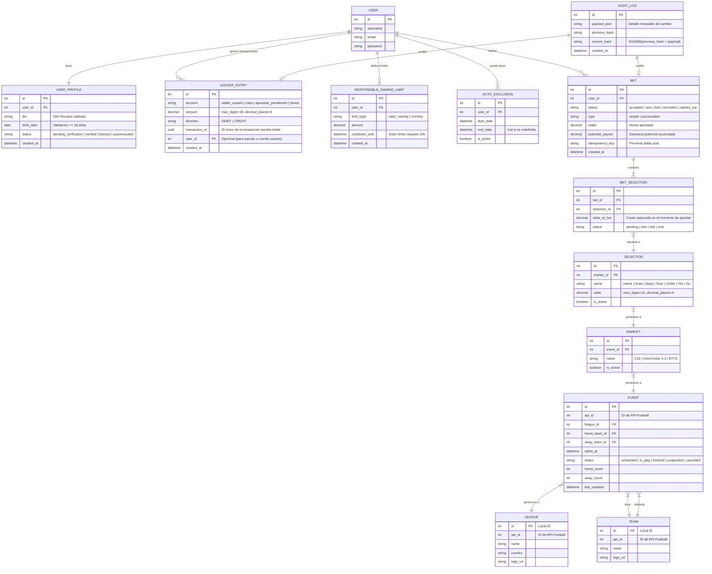

# Arquitectura de Integración API-Football V3 & Diseño de Base de Datos para FairBet Lab

Este documento presenta la guía detallada de integración de la API externa **API-Football V3** con el backend de **FairBet Lab** (desarrollado en Django), y diseña el esquema de base de datos relacional (PostgreSQL) para cumplir con todos los requerimientos técnicos y normativos del reto (incluyendo partida doble, juego responsable y auditoría inmutable).

---

## 1. ¿Cómo se relaciona el Backend con una API Externa?

Una API externa como **API-Football** no tiene "tablas" que puedas clonar directamente en tu base de datos mediante SQL o migraciones. En su lugar, expone **Endpoints de tipo REST (JSON)** a través del protocolo HTTP.

### El Flujo de Datos
```mermaid
graph LR
    API[API-Football V3] -- "1. Endpoints JSON (Fixtures/Odds)" --> Celery[Celery Tasks / Sync Engine]
    Celery -- "2. Mapear y Guardar/Actualizar" --> DB[(PostgreSQL Local)]
    DB -- "3. Consultar datos locales" --> Django[Django Backend / DRF]
    Django -- "4. REST API" --> Web[Frontend Web / App]
    Django -- "5. WebSockets" --> Channels[Django Channels (Odds en vivo)]
```

### Estrategia de Backend para FairBet Lab:
1. **No consumas la API externa en tiempo real por cada petición del usuario**: Esto consumiría tu cuota rápidamente, causaría latencia (1-2 segundos por request) y arruinaría la experiencia.
2. **Arquitectura local de Caché/Sincronización (Local Cache & Poll Engine)**: 
   - Utilizaremos **Celery + Celery Beat** para correr tareas en segundo plano periódicamente.
   - Estas tareas llamarán a los endpoints de API-Football (`/fixtures` y `/odds`), filtrarán los eventos que nos interesan (ej. partidos del Mundial o de ligas seleccionadas) y poblarán **nuestras tablas locales** (`Event`, `Market`, `Selection`).
   - El usuario siempre apuesta consultando **nuestra base de datos local**, lo cual es instantáneo (< 50ms) y seguro.

---

## 2. Principales Endpoints de API-Football y su Equivalente Local

Para entender cómo se ven los datos y cómo los convertimos en tablas locales, aquí tienes el mapeo clave de los endpoints de la API:

### A. Endpoint `/fixtures` (Partidos / Eventos)
* **¿Qué retorna?**: Información de partidos específicos, equipos, fechas, estadios y el estado del partido (Programado, En Vivo, Terminado, etc.).
* **Estructura JSON Simplificada de la API:**
```json
{
  "response": [
    {
      "fixture": {
        "id": 868686,
        "date": "2026-06-12T15:00:00-05:00",
        "status": { "long": "Not Started", "short": "NS" }
      },
      "league": { "id": 1, "name": "World Cup", "logo": "https://..." },
      "teams": {
        "home": { "id": 10, "name": "Peru", "logo": "https://..." },
        "away": { "id": 20, "name": "Argentina", "logo": "https://..." }
      },
      "goals": { "home": null, "away": null }
    }
  ]
}
```
* **Mapeo Local**: Este JSON se deserializa en Django y se guarda en las tablas `League`, `Team` y `Event` en tu base de datos local.

### B. Endpoint `/odds` (Cuotas Prematch)
* **¿Qué retorna?**: Las cuotas de apuestas de diferentes casas de apuestas (Bet365, William Hill, etc.) para distintos mercados (1X2, Over/Under, BTTS).
* **Estructura JSON de la API:**
```json
{
  "bookmakers": [
    {
      "id": 8, "name": "Bet365",
      "bets": [
        {
          "id": 1, "name": "Match Winner",
          "values": [
            { "value": "Home", "odd": "2.10" },
            { "value": "Draw", "odd": "3.40" },
            { "value": "Away", "odd": "3.60" }
          ]
        }
      ]
    }
  ]
}
```
* **Mapeo Local**: Nosotros leemos esto, aplicamos nuestro propio **margen de operador** (ej. reducir la cuota un 5% para asegurar ganancia matemática a la casa) y guardamos los mercados y cuotas resultantes en nuestras tablas locales `Market` y `Selection`.

---

## 3. Modelo de Entidad-Relación (MER) Completo

A continuación, se detalla la estructura lógica de base de datos para la plataforma educativa **FairBet Lab** usando sintaxis Mermaid para su visualización.



---

## 4. Estructura e Implementación de Modelos Django (Código de Referencia)

Aquí tienes la definición exacta en código Django que implementa estas bases de datos de forma profesional y robusta.

### A. Aplicación `accounts` (Usuarios, KYC y Juego Responsable)
```python
# accounts/models.py
from django.db import models
from django.contrib.auth.models import User
from django.utils import timezone
from decimal import Decimal

class UserProfile(models.Model):
    STATUS_CHOICES = (
        ('pending_verification', 'Pendiente Verificación'),
        ('verified', 'Verificado'),
        ('blocked', 'Bloqueado'),
        ('autoexcluded', 'Autoexcluido'),
    )
    user = models.OneToOneField(User, on_delete=models.CASCADE, related_name='profile')
    dni = models.CharField(max_length=9, unique=True)
    birth_date = models.DateField()
    status = models.CharField(max_length=30, choices=STATUS_CHOICES, default='pending_verification')
    created_at = models.DateTimeField(auto_now_add=True)

    @property
    def is_adult(self):
        # Calcular si es mayor de edad
        today = timezone.now().date()
        age = today.year - self.birth_date.year - ((today.month, today.day) < (self.birth_date.month, self.birth_date.day))
        return age >= 18

class ResponsibleGamingLimit(models.Model):
    LIMIT_TYPES = (
        ('daily', 'Diario'),
        ('weekly', 'Semanal'),
        ('monthly', 'Mensual'),
    )
    user = models.ForeignKey(User, on_delete=models.CASCADE, related_name='gaming_limits')
    limit_type = models.CharField(max_length=10, choices=LIMIT_TYPES)
    amount = models.DecimalField(max_digits=18, decimal_places=4)
    cooldown_until = models.DateTimeField(null=True, blank=True)
    created_at = models.DateTimeField(auto_now_add=True)

class AutoExclusion(models.Model):
    user = models.ForeignKey(User, on_delete=models.CASCADE, related_name='auto_exclusions')
    start_date = models.DateTimeField(auto_now_add=True)
    end_date = models.DateTimeField(null=True, blank=True) # null = Indefinida
    is_active = models.BooleanField(default=True)
```

### B. Aplicación `wallet` (Contabilidad Inmutable de Partida Doble)
> [!IMPORTANT]
> **Regla de Oro de Partida Doble**: No almacenamos el saldo en una columna estática de "saldo". El saldo es el resultado dinámico de `SUM(CREDIT) - SUM(DEBIT)`. Cada transacción debe crear al menos 2 registros cuyas sumas netas sean cero.

```python
# wallet/models.py
from django.db import models
from django.contrib.auth.models import User
from django.db.models import Sum

class LedgerEntry(models.Model):
    ACCOUNT_CHOICES = (
        ('wallet_usuario', 'Billetera del Usuario'),
        ('casa', 'Caja del Operador / Casa'),
        ('apuestas_pendientes', 'Fondo en Custodia de Apuestas'),
        ('bonos', 'Fondo de Bonos'),
    )
    DIRECTION_CHOICES = (
        ('DEBIT', 'Débito (Salida)'),
        ('CREDIT', 'Crédito (Entrada)'),
    )
    
    user = models.ForeignKey(User, on_delete=models.PROTECT, related_name='ledger_entries', null=True, blank=True)
    account = models.CharField(max_length=30, choices=ACCOUNT_CHOICES)
    amount = models.DecimalField(max_digits=18, decimal_places=4)
    direction = models.CharField(max_length=6, choices=DIRECTION_CHOICES)
    transaction_id = models.UUIDField(db_index=True)
    created_at = models.DateTimeField(auto_now_add=True)

    @classmethod
    def get_user_balance(cls, user):
        """
        Calcula el saldo del usuario sumando créditos y restando débitos.
        """
        credits = cls.objects.filter(user=user, account='wallet_usuario', direction='CREDIT').aggregate(total=Sum('amount'))['total'] or Decimal('0.0000')
        debits = cls.objects.filter(user=user, account='wallet_usuario', direction='DEBIT').aggregate(total=Sum('amount'))['total'] or Decimal('0.0000')
        return credits - debits
```

### C. Aplicación `sports` (Caché local de API-Football)
```python
# sports/models.py
from django.db import models

class League(models.Model):
    api_id = models.IntegerField(unique=True, help_text="ID oficial de API-Football")
    name = models.CharField(max_length=100)
    country = models.CharField(max_length=100)
    logo_url = models.URLField(max_length=500, null=True, blank=True)

class Team(models.Model):
    api_id = models.IntegerField(unique=True, help_text="ID oficial de API-Football")
    name = models.CharField(max_length=100)
    logo_url = models.URLField(max_length=500, null=True, blank=True)

class Event(models.Model):
    STATUS_CHOICES = (
        ('scheduled', 'Programado'),
        ('in_play', 'En Vivo'),
        ('finished', 'Finalizado'),
        ('suspended', 'Suspendido'),
        ('cancelled', 'Anulado'),
    )
    api_id = models.IntegerField(unique=True, help_text="ID oficial de API-Football")
    league = models.ForeignKey(League, on_delete=models.PROTECT, related_name='events')
    home_team = models.ForeignKey(Team, on_delete=models.PROTECT, related_name='home_events')
    away_team = models.ForeignKey(Team, on_delete=models.PROTECT, related_name='away_events')
    starts_at = models.DateTimeField()
    status = models.CharField(max_length=20, choices=STATUS_CHOICES, default='scheduled')
    home_score = models.IntegerField(null=True, blank=True)
    away_score = models.IntegerField(null=True, blank=True)
    last_updated = models.DateTimeField(auto_now=True)

class Market(models.Model):
    event = models.ForeignKey(Event, on_delete=models.CASCADE, related_name='markets')
    name = models.CharField(max_length=100) # Ej: "1X2", "Over/Under 2.5"
    is_active = models.BooleanField(default=True)

class Selection(models.Model):
    market = models.ForeignKey(Market, on_delete=models.CASCADE, related_name='selections')
    name = models.CharField(max_length=100) # Ej: "Home", "Draw", "Away"
    odds = models.DecimalField(max_digits=10, decimal_places=4) # Ej: 2.5000
    is_active = models.BooleanField(default=True)
```

### D. Aplicación `betting` (Apuestas Simples y Combinadas)
```python
# betting/models.py
from django.db import models
from django.contrib.auth.models import User
from sports.models import Selection

class Bet(models.Model):
    BET_STATUS = (
        ('accepted', 'Aceptada'),
        ('won', 'Ganada'),
        ('lost', 'Perdida'),
        ('cancelled', 'Cancelada / Anulada'),
        ('cashed_out', 'Cobro Anticipado'),
    )
    BET_TYPES = (
        ('simple', 'Simple'),
        ('accumulator', 'Combinada'),
    )
    user = models.ForeignKey(User, on_delete=models.PROTECT, related_name='bets')
    status = models.CharField(max_length=20, choices=BET_STATUS, default='accepted')
    type = models.CharField(max_length=20, choices=BET_TYPES, default='simple')
    stake = models.DecimalField(max_digits=18, decimal_places=4)
    potential_payout = models.DecimalField(max_digits=18, decimal_places=4)
    idempotency_key = models.UUIDField(unique=True, db_index=True)
    created_at = models.DateTimeField(auto_now_add=True)

class BetSelection(models.Model):
    SELECTION_STATUS = (
        ('pending', 'Pendiente'),
        ('won', 'Ganada'),
        ('lost', 'Perdida'),
        ('void', 'Anulada'),
    )
    bet = models.ForeignKey(Bet, on_delete=models.CASCADE, related_name='selections')
    selection = models.ForeignKey(Selection, on_delete=models.PROTECT)
    odds_at_bet = models.DecimalField(max_digits=10, decimal_places=4) # Captura histórica al apostar
    status = models.CharField(max_length=20, choices=SELECTION_STATUS, default='pending')
```

### E. Aplicación `audit` (Auditoría Inmutable)
> [!TIP]
> Para garantizar que nadie altere el historial de apuestas ni de transacciones, creamos un registro inmutable encadenado por un hash criptográfico. Si una fila es modificada, los hashes posteriores se rompen, lo que alerta al sistema sobre manipulación de datos.

```python
# audit/models.py
import hashlib
import json
from django.db import models

class AuditLog(models.Model):
    payload = models.JSONField(help_text="Payload completo del evento auditado")
    previous_hash = models.CharField(max_length=64, db_index=True)
    current_hash = models.CharField(max_length=64)
    created_at = models.DateTimeField(auto_now_add=True)

    @classmethod
    def append_log(cls, data_dict):
        """
        Calcula el hash inmutable a partir del registro anterior y el nuevo payload.
        """
        last_log = cls.objects.order_by('-id').first()
        prev_hash = last_log.current_hash if last_log else "0" * 64
        
        # Generar hash de este log
        serialized_payload = json.dumps(data_dict, sort_keys=True, default=str)
        hash_string = f"{prev_hash}{serialized_payload}"
        curr_hash = hashlib.sha256(hash_string.encode('utf-8')).hexdigest()
        
        return cls.objects.create(
            payload=data_dict,
            previous_hash=prev_hash,
            current_hash=curr_hash
        )
```

---

## 5. El Flujo Transaccional en Partida Doble (Caso Práctico)

Cuando un usuario realiza una apuesta de **100 fichas** a una cuota de **2.50**:

1. **Estado Inicial**:
   - Saldo de usuario: `1000 fichas`
2. **Validación del Wallet**:
   - Comprobamos si tiene balance suficiente (`1000 >= 100`).
3. **Bloqueo de Fondos en Base de Datos (Transacción Atómica)**:
   - Se crea un ID único de transacción UUID.
   - **Entrada 1 (DÉBITO)**: Cuenta `wallet_usuario`, Monto `100`, Dirección `DEBIT`.
   - **Entrada 2 (CRÉDITO)**: Cuenta `apuestas_pendientes`, Monto `100`, Dirección `CREDIT`.
   - *La suma de ambos da 0 (`+100` y `-100`). El saldo disponible del usuario cae dinámicamente a `900 fichas`.*
   - Se crea la apuesta `Bet` con `stake = 100`, `potential_payout = 250` y estado `accepted`.
4. **Liquidación (El evento termina y el usuario GANA)**:
   - **Entrada 3 (DÉBITO)**: Cuenta `apuestas_pendientes`, Monto `100`, Dirección `DEBIT` (se libera el depósito).
   - **Entrada 4 (DÉBITO)**: Cuenta `casa`, Monto `150`, Dirección `DEBIT` (la casa paga la ganancia neta).
   - **Entrada 5 (CRÉDITO)**: Cuenta `wallet_usuario`, Monto `250`, Dirección `CREDIT` (se le abona la cuota al usuario).
   - *La suma total del lote de liquidación es balanceada:*
     $$\text{Suma} = -100_{\text{apuestas\_pendientes}} - 150_{\text{casa}} + 250_{\text{wallet\_usuario}} = 0$$
   - El estado de la apuesta cambia a `won`. El saldo del usuario es ahora `1150 fichas`.

---

## 6. Siguientes Pasos Recomendados

1. **Configurar el Celery Worker**: Escribir tareas para consumir periódicamente de `https://v3.football.api-sports.io/fixtures` y `/odds` usando la librería `requests` de Python, guardando la información en tus modelos `Event`, `Market` y `Selection`.
2. **Implementar las Rutas en Django REST Framework**: Endpoints de `/api/bets/` para colocar apuestas simples o combinadas.
3. **Agregar Bloqueo de Concurrencia**: En el código donde se mueve dinero, utilizar:
   ```python
   with transaction.atomic():
       # select_for_update bloquea la fila del usuario para evitar doble gasto simultáneo
       profile = UserProfile.objects.select_for_update().get(user=user)
       # ... realizar partida doble ...
   ```
4. **Escribir Pruebas con Hypothesis**: Para validar de forma automatizada que los débitos y créditos del Ledger global siempre sumen exactamente `0.0000`.
